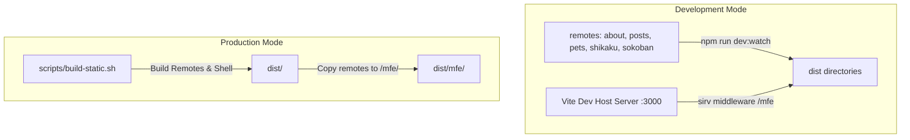

# 👾 Cozy OS - prxxie

Welcome to **Cozy OS - prxxie**, a retro-styled personal portfolio and dashboard site configured like a pixel-art desktop operating system. It features interactive panels, virtual pet behaviors, and retro arcade/puzzle games.

Built with **React**, **Vite**, and **Tailwind CSS v4**, this project is architected as a **React micro-frontend monorepo** utilizing **Module Federation** to load components lazily.

---

## 🏛 Architecture

The workspace is organized as a monorepo using npm workspaces. It consists of a **host shell** and several **remote micro-frontends (MFEs)**:

```text
packages/
├── shell/     (Host - Port 3000)      — Layout chrome, navigation, Zustand state store, remote MFE lazy-loading
├── about/     (Remote - Port 3001)    — Skill display and bio folders
├── posts/     (Remote - Port 3002)    — Markdown-driven devlog/blog viewer
├── pets/      (Remote - Port 3003)    — TAMAGOTCHI-style virtual pet interactive widget
├── shikaku/   (Remote - Port 3004)    — Grid puzzle game with 20 levels, validation engine, solver, and audio synth
├── sokoban/   (Remote - Port 3005)    — Classic crate-pushing game
└── shared/    (Shared library)        — Core interfaces, local storage repositories, and evolution algorithms
```

### Module Federation & Build Setup



In dev mode, sibling micro-frontends compile via Vite watch builds to their `dist/` folders. The shell uses custom Vite middleware via `sirv` to mount and serve these folders directly at `/mfe/<name>`, keeping everything served on a single port (`3000`) and avoiding CORS/port mismatch complications.

---

## 🕹 Features

1. **Home OS**: Terminal dashboard, telemetry diagnostics, and app menus.
2. **About**: Interactive OS foldered folders displaying developer skills and background information.
3. **Posts**: Markdown parser rendering devlogs with Prism.js code syntax highlighting.
4. **Pets**: Pixel-art Tamagotchi companion. Uses a shared Zustand state from the shell, decaying hunger/happiness over time, with evolution progression.
5. **Shikaku**: Hands-on grid puzzle game with dragging selections, hint engines, backtracking solver, and sound synth.
6. **Sokoban**: Grid-based box-moving puzzle game.

---

## 🚀 Getting Started

### Prerequisites
- Node.js (v18+)
- npm

### Development
1. Install dependencies:
   ```bash
   npm install
   ```
2. Start the development environment (starts all MFEs and the shell):
   ```bash
   npm run dev
   ```
3. Open `http://localhost:3000` in your browser.

### Test & Lint
- Run test suites (Vitest):
  ```bash
  npm run test
  ```
- Lint codebase (ESLint):
  ```bash
  npm run lint
  ```
- Typecheck (TypeScript):
  ```bash
  npm run typecheck
  ```

### Build for Production
Assemble the production bundle into `/dist` via:
```bash
npm run build:static
```
This runs the `scripts/build-static.sh` script, compiling remotes, building the host shell, and arranging assets in the correct structure.
