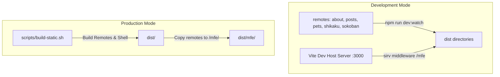

# README.md and CLAUDE.md Documentation Implementation Plan

> **For agentic workers:** REQUIRED SUB-SKILL: Use superpowers:subagent-driven-development (recommended) or superpowers:executing-plans to implement this plan task-by-task. Steps use checkbox (`- [ ]`) syntax for tracking.

**Goal:** Create comprehensive user and developer agent documentation for the Cozy OS micro-frontend project.

**Architecture:** We will write README.md for human visitors (explaining architecture, features, and monorepo structure) and CLAUDE.md for agentic developers (explaining commands, style guides, and RTK rules).

**Tech Stack:** Markdown, Mermaid.js

---

### Task 1: Create README.md

**Files:**
- Create: `/home/cpt0912/WORKS/CDEV/prxxie-home/README.md`

- [ ] **Step 1: Write the README.md content**
  Create the `/home/cpt0912/WORKS/CDEV/prxxie-home/README.md` file with the following complete content:

```markdown
# 👾 Cozy OS - prxxie

Welcome to **Cozy OS - prxxie**, a retro-styled personal portfolio and dashboard site configured like a pixel-art desktop operating system. It features interactive panels, virtual pet behaviors, and retro arcade/puzzle games.

Built with **React**, **Vite**, and **Tailwind CSS v4**, this project is architected as a **React micro-frontend monorepo** utilizing **Module Federation** to load components lazily.

---

## 🏛 Architecture

The workspace is organized as a monorepo using npm workspaces. It consists of a **host shell** and several **remote micro-frontends (MFEs)**:

```text
packages/
├── shell/     (Host - Port 3000)      — Layout chrome, navigation, Zustand state store, remote MFE lazy-loading
├── about/     (Remote - Port 3001)    — Skill display and bio folders
├── posts/     (Remote - Port 3002)    — Markdown-driven devlog/blog viewer
├── pets/      (Remote - Port 3003)    — TAMAGOTCHI-style virtual pet interactive widget
├── shikaku/   (Remote - Port 3004)    — Grid puzzle game with 20 levels, validation engine, solver, and audio synth
├── sokoban/   (Remote - Port 3005)    — Classic crate-pushing game
└── shared/    (Shared library)        — Core interfaces, local storage repositories, and evolution algorithms
```

### Module Federation & Build Setup



In dev mode, sibling micro-frontends compile via Vite watch builds to their `dist/` folders. The shell uses custom Vite middleware via `sirv` to mount and serve these folders directly at `/mfe/<name>`, keeping everything served on a single port (`3000`) and avoiding CORS/port mismatch complications.

---

## 🕹 Features

1. **Home OS**: Terminal dashboard, telemetry diagnostics, and app menus.
2. **About**: Interactive OS foldered folders displaying developer skills and background information.
3. **Posts**: Markdown parser rendering devlogs with Prism.js code syntax highlighting.
4. **Pets**: Pixel-art Tamagotchi companion. Uses a shared Zustand state from the shell, decaying hunger/happiness over time, with evolution progression.
5. **Shikaku**: Hands-on grid puzzle game with dragging selections, hint engines, backtracking solver, and sound synth.
6. **Sokoban**: Grid-based box-moving puzzle game.

---

## 🚀 Getting Started

### Prerequisites
- Node.js (v18+)
- npm

### Development
1. Install dependencies:
   ```bash
   npm install
   ```
2. Start the development environment (starts all MFEs and the shell):
   ```bash
   npm run dev
   ```
3. Open `http://localhost:3000` in your browser.

### Test & Lint
- Run test suites (Vitest):
  ```bash
  npm run test
  ```
- Lint codebase (ESLint):
  ```bash
  npm run lint
  ```
- Typecheck (TypeScript):
  ```bash
  npm run typecheck
  ```

### Build for Production
Assemble the production bundle into `/dist` via:
```bash
npm run build:static
```
This runs the `scripts/build-static.sh` script, compiling remotes, building the host shell, and arranging assets in the correct structure.
```

- [ ] **Step 2: Verify file existence**
  Run: `ls -la /home/cpt0912/WORKS/CDEV/prxxie-home/README.md`
  Expected: File details printed with correct size.

- [ ] **Step 3: Commit the README.md**
  Run:
  ```bash
  rtk git add README.md
  rtk git commit -m "docs: add project README.md"
  ```
  Expected: Successful commit.

---

### Task 2: Create CLAUDE.md

**Files:**
- Create: `/home/cpt0912/WORKS/CDEV/prxxie-home/CLAUDE.md`

- [ ] **Step 1: Write the CLAUDE.md content**
  Create the `/home/cpt0912/WORKS/CDEV/prxxie-home/CLAUDE.md` file with the following complete content:

```markdown
# CLAUDE.md — Cozy OS Development Guide

This guide describes development workflows, commands, and rules for agents and developers working in this codebase.

## 🛠 Commands Reference

Execute commands at the repository root. Always prefix execution commands with `rtk` (Rust Token Killer) to optimize token usage.

* **Start dev server (all packages)**: `rtk npm run dev`
* **Production static build**: `rtk npm run build:static`
* **Build individual packages**: `rtk npm run build -w packages/<name>`
* **Run tests (Vitest)**: `rtk npm run test`
* **Lint codebase**: `rtk npm run lint`
* **Type-check codebase**: `rtk npm run typecheck`

---

## ⚡ Rust Token Killer (RTK) Rules
Always use the `rtk` CLI proxy directly for execution operations:
- `rtk gain` — Check token analytics.
- `rtk discover` — Find optimization opportunities in shell history.
- `rtk proxy <cmd>` — Force raw command execution (debugging only).
- Standard git commands are automatically transparently intercepted; if you face issue, prefix explicitly with `rtk`.

---

## 📐 Code Style & Guidelines

### TypeScript & React
* Use React 18, functional components, and TypeScript (types, interfaces, no implicit `any`).
* Manage state using **Zustand** hooks.
* Load remote micro-frontends (MFEs) lazily with `React.lazy` and enclose them in a `<Suspense>` wrapper with a custom fallback component.
* Follow the props-based state injection pattern: only the `pets` MFE is injected with the shell host's `usePetStore` Zustand hook. Other MFEs must remain fully self-contained.

### Styling
* Use **Tailwind CSS v4** for layout and styling.
* Main custom tokens, animations, scanlines, CRT screen overlays, and retro layout styling are declared in `/packages/shell/src/index.css`. Use these predefined CSS variable tokens rather than creating ad-hoc color utility classes.

### Testing
* Write unit/integration tests with **Vitest**.
* In the `shell` host tests, mock all remote micro-frontends to prevent bundler resolution issues.
* Separate core business engines (like Shikaku solver or synth logic) from React components to keep them cleanly unit-testable.
```

- [ ] **Step 2: Verify file existence**
  Run: `ls -la /home/cpt0912/WORKS/CDEV/prxxie-home/CLAUDE.md`
  Expected: File details printed with correct size.

- [ ] **Step 3: Commit the CLAUDE.md**
  Run:
  ```bash
  rtk git add CLAUDE.md
  rtk git commit -m "docs: add CLAUDE.md developer instructions"
  ```
  Expected: Successful commit.
