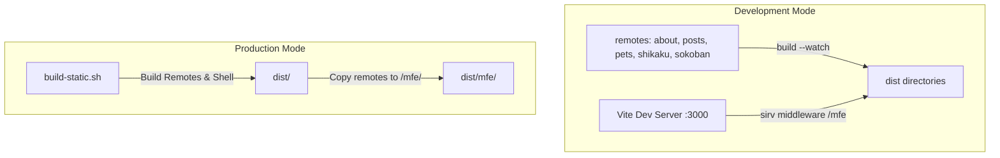

# Design Spec: README.md and CLAUDE.md Documentation

**Date**: 2026-06-01
**Topic**: Project documentation and developer agent guidelines for the Cozy OS monorepo.

---

## 1. Overview
The goal is to create two essential entry point documentation files at the root of the project:
1. `README.md` — The public-facing entry point of the project detailing its purpose, architecture, modular structure, and getting started instructions.
2. `CLAUDE.md` — An instruction manual and command reference guide for AI developer agents (like Claude Code and Gemini) working in this codebase, incorporating the strict `rtk` (Rust Token Killer) global rules.

---

## 2. README.md Specifications

### 2.1 Content Outline
- **Header**: Visual branding, project tagline, technology stack badges.
- **Features**: List of Cozy OS features (Home, About, Posts, Pets, Shikaku, Sokoban).
- **Architecture**: Explanation of the Vite Module Federation architecture.
  - Sibling package setup.
  - Cross-package state sharing via Zustand hooks.
- **Mermaid Diagram**: Detailed mapping of dev vs. production build and loading pipeline.
- **Directory Structure**:
  - Root configuration (`package.json`, workspaces).
  - Shell (`packages/shell`).
  - Shared (`packages/shared`).
  - Remote Micro-frontends (`packages/about`, `packages/posts`, `packages/pets`, `packages/shikaku`, `packages/sokoban`).
- **Getting Started**:
  - How to install dependencies.
  - How to start the dev server (`npm run dev`).
  - Build/packaging commands (`npm run build:static`).

### 2.2 Mermaid Diagram Details

---

## 3. CLAUDE.md Specifications

### 3.1 Content Outline
- **Build and Test Commands**:
  - Run development mode: `npm run dev`
  - Build all remotes and host: `npm run build`
  - Compile & bundle production: `npm run build:static`
  - Run unit tests: `npm run test`
  - Lint source code: `npm run lint`
  - Type-check code: `npm run typecheck`
- **Rust Token Killer (RTK) Rules**:
  - Global `rtk` commands.
  - Proxy commands.
  - Transparent hook behavior.
- **Development & Coding Standards**:
  - **Module Federation Constraints**: Entry point files must be named `*App.tsx` and exported under correct remote routes. Shared packages must be specified in the federation config.
  - **Shared Store**: Only `pets` is allowed to receive `usePetStore` from the host. Standalone fallbacks should use internal mock stores.
  - **Styling**: Tailwind CSS v4 is used; custom design tokens (retro, colors) are defined in `shell/src/index.css`.
  - **Testing**: Remotes must be mocked in shell unit tests to avoid bundler resolution issues. Keep logical validation engines decoupled and unit-tested.

---

## 4. Spec Self-Review
1. **Placeholder Scan**: Checked. No TODOs or placeholders are present in the design.
2. **Consistency**: The architecture description matches existing config files found during exploration (`vite.config.ts`, `build-static.sh`).
3. **Scope Check**: Scope is limited to the two Markdown files. No code modifications required.
4. **Ambiguity Check**: Build and dev commands align exactly with root `package.json` scripts.
